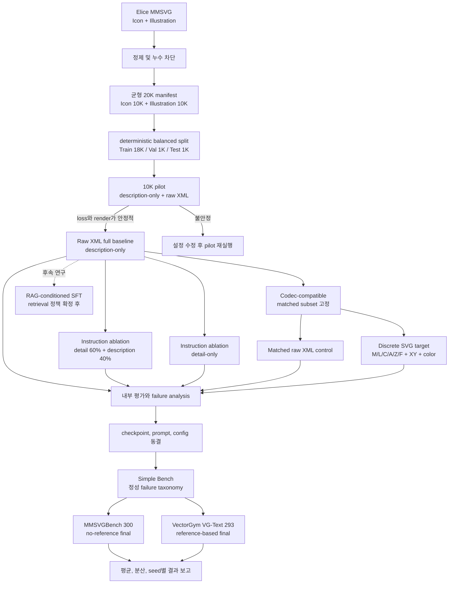

# Generator SFT 및 Discrete SVG Ablation 계획

## 1. 목적과 고정 원칙

이 문서는 Gemma 4 Generator의 첫 SFT와 후속 ablation을 서로 혼동하지 않도록
실험 순서, 데이터 경계, loss 범위 및 평가 동결 시점을 고정한다.

- 첫 baseline은 **RAG가 없는 `description -> raw SVG XML`**이다.
- SFT target에만 next-token loss를 적용한다. system/instruction token label은 `-100`으로
  masking한다.
- 데이터는 Elice Cloud GPU 서버의 MMSVG Icon/Illustration에서 가져온다. 저장 위치는
  config/CLI로 주입하며 저장소에 원본 데이터나 weight를 넣지 않는다.
- 전체 20K는 Icon 10K와 Illustration 10K로 균형화한다.
- `MMSVGBench`와 `VectorGym VG-Text`는 학습, 검색, prompt refinement에서 제외한다.
- raw XML baseline과 discrete codec은 별도 target representation이다. 한 sample 안에서 두
  표현을 혼합하지 않는다.
- prompt optimizer는 도입하지 않는다. Generator prompt는 related work의 일반 원칙과
  프로젝트의 `STATIC_SVG_POLICY`만 반영하고 benchmark 문장을 few-shot으로 넣지 않는다.

## 2. 전체 진행 다이어그램



10K pilot은 20K pool 안의 고정 train subset이다. 새 데이터를 추가로 뽑지 않는다. pilot에서
loss 폭주, target truncation, parse/render 실패가 없을 때만 18K train 전체로 확장한다.

## 3. 데이터 선택과 split

| Split | Icon | Illustration | 합계 | 용도 |
|---|---:|---:|---:|---|
| Train | 9,000 | 9,000 | 18,000 | SFT 및 10K pilot subset |
| Validation | 500 | 500 | 1,000 | loss, parse/render 지표, checkpoint 선택 |
| Internal test | 500 | 500 | 1,000 | 동결 전 일반화와 failure 분석 |
| 전체 | 10,000 | 10,000 | 20,000 | 고정 dataset manifest |

선정 순서는 다음과 같다.

1. dataset ID, source revision, 원본 row pointer를 기록한다.
2. `description`, `detail`, SVG code가 모두 존재하는 row를 우선한다. description-only
   baseline 자체에는 detail을 입력하지 않는다.
3. hardened XML validator, static-SVG policy 및 render gate를 통과한 SVG만 사용한다.
4. canonical SVG hash로 exact duplicate를 제거한다.
5. 현재 v1은 canonical SVG hash 기반 exact duplicate를 제거한다. 검증된 MMSVG cluster key가
   제공되기 전에는 perceptual 또는 semantic near-duplicate 제거를 수행했다고 간주하지 않는다.
6. source cluster/group key가 확보되면 동일 cluster가 둘 이상의 split에 들어가지 않도록
   group split을 별도 data-manifest version으로 추가한다.
7. MMSVGBench와 VectorGym prompt/reference의 exact duplicate를 모든 train/RAG
   후보에서 제거한다.
8. tokenizer 기준 target 길이가 학습 max length를 넘는 row를 제외하거나 별도 length
   bucket으로 관리한다. SVG 문자열을 중간에서 자르지 않는다.
9. seed, 필터별 탈락 사유, 최종 row ID와 split을 immutable manifest에 기록한다.

RAG 팀이 미리 계산하는 top-3 retrieval ID와 score는 provenance 필드로 저장할 수 있다.
그러나 baseline SFT message에는 SVG retrieval context를 넣지 않는다.

## 4. 공통 SFT message와 loss 계약

### Raw XML target

```text
<system>SVG Generator system prompt</system>
<user>{description 또는 선택된 detail}</user>
<assistant><svg ...>...</svg></assistant>
```

Loss mask는 다음과 같다.

```text
system tokens       -> -100
user/instruction    -> -100
assistant prefix    -> -100
SVG response tokens -> token id (loss 적용)
padding             -> -100
```

즉 "SVG target에만 next-token loss"는 instruction을 모델이 다시 예측하도록 학습하지
않고, 주어진 instruction 다음의 SVG response token만 예측하도록 학습한다는 뜻이다.

### Discrete target

```text
<system>동일 Generator system prompt</system>
<user>동일 instruction</user>
<assistant>
  <|svgd1:sop|> ... <|svgd1:cmd:F|> <|svgd1:rgb:abc|>
  <|svgd1:eop|> ... <|svgd1:eos|>
</assistant>
```

Discrete 실험도 instruction까지 `-100`으로 mask하고 `SOP`부터 `EOS`까지만 loss를
적용한다. raw XML token과 discrete token을 한 target에서 연결하거나 섞지 않는다.

## 5. Instruction 분포 ablation

동일한 split, seed, optimizer budget, LoRA rank 및 evaluation prompt를 유지한다.

| ID | Target | Instruction 선택 | 역할 |
|---|---|---|---|
| `R0` | raw XML | description-only | 첫 baseline 및 기준점 |
| `R1` | raw XML | row별 고정 hash로 detail 60%, description 40% | 팀 기본안 비교 |
| `R2` | raw XML | detail-only | 장문 instruction ablation |

`R1`의 60/40 선택은 epoch마다 바꾸지 않는다. `dataset_id + experiment_seed`의 stable
hash로 한 번 결정해 run 간 데이터 조건을 재현한다. `detail`이 결측이면 해당 row는
`R1/R2` 공통 pool에서 제외하며 description으로 조용히 대체하지 않는다.

비교 지표에는 전체 지표 외에 Icon/Illustration, instruction length bucket 및 object count
bucket별 결과를 함께 기록한다. detail-only가 데이터 문구를 잘 재현하더라도 짧은 실제
사용자 prompt에서 성능이 낮아지는지 별도로 확인한다.

## 6. Discrete SVG codec ablation

[`discrete_codec.py`](../src/svg_agentic_slm/svg/discrete_codec.py)의
`OmniSVGDiscreteCodec`은 OmniSVG의 path command, 2D coordinate, color 분해에서 영감을
받은 **로컬 실험 codec**이다.

- 명령: `M`, `L`, `C`, `A`, `Z`, fill/end marker `F`
- 경계: `SOP`, `EOP`, `EOS`
- 좌표: 기본 200 x 200 grid의 `(x, y)` 한 쌍당 token 하나, 총 40,000개
- 색상: channel당 4-bit RGB token과 `none`
- 입력 subset: direct `path`만 허용하고 `d`, `fill` 외 속성은 거부
- unsupported element, relative/unsupported command, transform, stroke, gradient, text,
  external reference는 변환하지 않고 fail-closed
- token namespace: `svgd1`; `vocabulary_tokens()` 결과를 HF tokenizer의
  `additional_special_tokens`로 등록
- codec version, vocabulary hash, 지원 범위는 `manifest()`로 artifact에 저장

이 codec은 공식 OmniSVG의 아이디어를 재현 가능한 문자열 token으로 옮긴 ablation이며,
공식 token ID, embedding 또는 checkpoint와 호환되지 않는다. "OmniSVG weight를 그대로
사용한다"거나 "공식 codec 재현"이라고 보고하지 않는다.

### 공정한 비교

path-only 제한 때문에 전체 raw XML pool과 바로 비교하면 데이터 난이도가 confound가 된다.
따라서 codec 변환에 성공한 row ID를 `codec-compatible matched subset`으로 고정하고 아래 두
run을 같은 sample, instruction 및 training budget으로 수행한다.

| ID | Sample | Target | 비교 목적 |
|---|---|---|---|
| `C1` | codec-compatible matched subset | raw XML | 제한 subset control |
| `C2` | `C1`과 동일 | discrete token | target representation 효과 |

1차 codec 실험은 description-only로 고정한다. `C2`가 `C1`보다 유의미하게 개선될 때만
60/40 instruction과의 상호작용을 후속 실험으로 연다. 이렇게 해야 3개 instruction 분포와
2개 target 형식의 불필요한 full-factorial 학습을 피할 수 있다.

## 7. Gemma 4 QLoRA 실행 계약

- 학습 가능한 Gemma 4 12B Hugging Face checkpoint를 `model_name_or_path`로 주입한다.
- 4-bit base weight와 LoRA adapter를 사용하는 QLoRA를 기본으로 한다.
- tokenizer에 discrete vocabulary를 추가하는 것은 `C2`에서만 수행한다.
- 추가 token embedding 및 output head는 학습 가능 상태인지 명시적으로 확인하고 저장한다.
- raw XML run의 tokenizer/vocabulary는 변경하지 않는다.
- gradient checkpointing, effective batch size, learning rate, warmup, max sequence length,
  seed 및 총 optimizer step을 모든 비교 run에서 기록한다.
- validation loss 하나만으로 선택하지 않고 XML/codec decode 성공률, validator 통과율,
  render 성공률을 같이 사용한다.
- adapter, tokenizer, codec manifest, base model revision 및 data manifest hash를 하나의
  checkpoint provenance로 묶는다.

### 실행 순서

원본 MMSVG와 benchmark exclusion 파일은 Elice 서버에서 받은 뒤
`configs/data_mmsvg_sft.yaml`의 경로에 주입한다. placeholder 경로가 남아 있거나 exclusion
파일이 없으면 데이터 준비는 fail-closed한다.

```bash
conda create -n svg python=3.11 -y
conda activate svg
pip install -e '.[train,rag,render]'

svg-agentic-slm prepare-sft --config configs/data_mmsvg_sft.yaml
```

GPU 0, 1, 2에서 3-process Accelerate 학습을 실행한다.

```bash
# R0: description-only raw XML baseline
bash scripts/run_generator_sft.sh configs/train_lora.yaml

# R1: detail 60% + description 40%
bash scripts/run_generator_sft.sh configs/train_lora_mixed.yaml

# R2: detail-only
bash scripts/run_generator_sft.sh configs/train_lora_detail.yaml

# C2: codec-compatible discrete SVG target ablation
bash scripts/run_generator_sft.sh configs/train_lora_discrete.yaml
```

`C1`은 `C2` 데이터 준비 manifest에서 codec 변환에 성공한 동일 row만 골라 raw XML config로
학습하는 matched control이다. 이 row manifest가 생성되기 전에는 `C1/C2` 비교를 시작하지
않는다.

학습된 raw adapter를 기존 RAG-Generator-Critic 파이프라인에 연결하는 예시는 다음과 같다.

```bash
CUDA_VISIBLE_DEVICES=0,1,2 svg-agentic-slm generate \
  'Create a simple icon of a teal circle centered on a warm ivory canvas.' \
  --config configs/generation.yaml \
  --model-config configs/models/gemma4-sft-raw.yaml \
  --output outputs/generations/gemma4_sft_raw.svg \
  --rag --critic --set generation.orchestration.critic_type=both
```

데이터 준비 후 먼저 R0의 고정 10K train subset으로 pilot을 실행하고 loss, target length,
decode/validator/render 지표를 확인한 다음 18K 전체로 확장한다. 실제 subset manifest와 step
budget은 데이터가 서버에 연결된 시점에 고정하며, 서로 다른 row 수의 결과를 같은 budget
실험으로 보고하지 않는다.

## 8. RAG 경계와 후속 실험

baseline 학습 입력에 RAG를 제외하는 이유는 Generator weight 효과와 retrieval 효과를 먼저
분리하기 위해서다. 추론 시 기존 MMSVG RAG를 켠 결과와 끈 결과는 같은 checkpoint로 비교할
수 있지만, 이를 RAG-conditioned SFT로 부르지 않는다.

후속 RAG SFT는 description/detail dual index, 중복 결과 처리, SigLIP rerank, context token
budget 및 benchmark leakage 정책이 확정된 뒤 별도 experiment ID로 추가한다. SFT row에는
retrieved row ID, dataset revision, score, rank 및 context packing 결과를 기록한다. 검색 SVG를
문자 단위로 자르거나 source text/ID를 그대로 복사하도록 지시하지 않는다.

## 9. 평가와 prompt refinement 순서

1. Train/validation curve, response-only mask 통계, truncation 비율을 확인한다.
2. Internal test에서 parse, static policy, render, instruction alignment 및 geometry failure를
   분류한다.
3. Simple Bench는 failure mode 관찰과 Generator prompt refinement에 사용한다. 변경할 때마다
   prompt version/hash를 갱신한다.
4. prompt, checkpoint, critic, RAG 설정과 decoding parameter를 동결한다.
5. 동결 후 MMSVGBench Text-to-SVG 300건과 VectorGym VG-Text 293건을 한 번 평가한다.
6. 동일 prompt에 여러 generation seed를 사용하고 평균, 표준편차, accept/revision rate와
   failure taxonomy 분포를 보고한다.

최종 benchmark 결과를 본 뒤 prompt를 다시 고치고 같은 결과를 최종 점수로 보고하면 test
leakage가 된다. 수정이 필요하면 기존 benchmark run은 development run으로 명시하고 새
held-out 평가 계획을 먼저 정한다.

## 10. 실험 완료 조건

- 모든 sample이 immutable row ID, source revision, split 및 filtering reason을 가진다.
- `R0/R1/R2`가 동일 split과 학습 budget으로 비교된다.
- 모든 run에서 instruction token의 label이 `-100`이고 target에만 loss가 적용된다.
- `C1/C2`가 동일 codec-compatible row와 instruction을 사용한다.
- discrete artifact가 codec version과 vocabulary SHA-256을 포함한다.
- checkpoint별 raw decode, validator, render 성공률과 failure taxonomy가 남는다.
- final benchmark 전 prompt/config/checkpoint hash가 동결된다.

## 11. Related work 근거

- OmniSVG paper: <https://arxiv.org/abs/2504.06263>
- OmniSVG official implementation: <https://github.com/OmniSVG/OmniSVG>
- OmniSVG official training implementation: <https://github.com/OpenVGLab/OmniSVG-Train>
- MMSVG Icon: <https://huggingface.co/datasets/OmniSVG/MMSVG-Icon>
- MMSVG Illustration: <https://huggingface.co/datasets/OmniSVG/MMSVG-Illustration>
- MMSVGBench: <https://huggingface.co/datasets/OmniSVG/MMSVGBench>
- VectorGym: <https://huggingface.co/datasets/ServiceNow/VectorGym>

프롬프트 정렬은 공식 OmniSVG inference의 일반 원칙인 정확한 SVG, key shape, spatial
relationship, proper coordinate/color, visual composition만 반영한다. 공식 예제나 benchmark
문장을 system/user prompt에 삽입하지 않는다.
